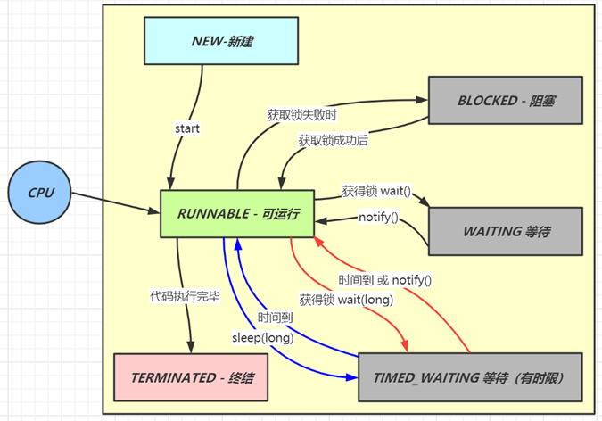

# 并发篇

## 1. 线程状态

**要求**

* 掌握 Java 线程六种状态
* 掌握 Java 线程状态转换
* 能理解五种状态与六种状态两种说法的区别

**六种状态及转换**



分别是

* 新建
  * 当一个线程对象被创建，但还未调用 start 方法时处于**新建**状态
  * 此时未与操作系统底层线程关联
* 可运行
  * 调用了 start 方法，就会由**新建**进入**可运行**
  * 此时与底层线程关联，由操作系统调度执行
* 终结
  * 线程内代码已经执行完毕，由**可运行**进入**终结**
  * 此时会取消与底层线程关联

新建→可运行→终结：是单向不可逆的过程

* 阻塞
  * 当获取锁失败后，由**可运行**进入 Monitor 的阻塞队列**阻塞**，此时不占用 cpu 时间
  * 当持锁线程释放锁时，会按照一定规则唤醒阻塞队列中的**阻塞**线程，唤醒后的线程进入**可运行**状态
* 等待
  * 当获取锁成功后，但由于条件不满足，调用了 wait() 方法，此时从**可运行**状态释放锁进入 Monitor 等待集合**等待**，同样不占用 cpu 时间
  * 当其它持锁线程调用 notify() 或 notifyAll() 方法，会按照一定规则唤醒等待集合中的**等待**线程，恢复为**可运行**状态
* 有时限等待
  * 当获取锁成功后，但由于条件不满足，调用了 wait(long) 方法，此时从**可运行**状态释放锁进入 Monitor 等待集合进行**有时限等待**，同样不占用 cpu 时间
  * 当其它持锁线程调用 notify() 或 notifyAll() 方法，会按照一定规则唤醒等待集合中的**有时限等待**线程，恢复为**可运行**状态，并重新去竞争锁
  * 如果等待超时，也会从**有时限等待**状态恢复为**可运行**状态，并重新去竞争锁
  * 还有一种情况是调用 sleep(long) 方法也会从**可运行**状态进入**有时限等待**状态，但与 Monitor 无关，不会释放锁，不需要主动唤醒，超时时间到自然恢复为**可运行**状态

> ***其它情况（只需了解）***
>
> * 可以用 interrupt() 方法打断**等待**、**有时限等待**的线程，让它们恢复为**可运行**状态
> * park，unpark 等方法也可以让线程等待和唤醒

```java
public class TestThreadState {
    static final Object LOCK = new Object();
    public static void main(String[] args) throws InterruptedException {
        testWaiting();
    }

    private static void testWaiting() {
        Thread t2 = new Thread(() -> {
            synchronized (LOCK) {
                logger1.debug("before waiting"); // 1		-------------------断点位置
                try {
                    LOCK.wait(); // 3
                } catch (InterruptedException e) {
                    e.printStackTrace();
                }
            }			//									-------------------断点位置
        },"t2");

        t2.start();
        main.debug("state: {}", t2.getState()); // 2		-------------------断点位置
        synchronized (LOCK) {
            main.debug("state: {}", t2.getState()); // 4
            LOCK.notify(); // 5
            main.debug("state: {}", t2.getState()); // 6
        }
        main.debug("state: {}", t2.getState()); // 7
    }

    private static void testBlocked() {
        Thread t2 = new Thread(() -> {
            logger1.debug("before sync"); // 3		-------------------断点位置
            synchronized (LOCK) {
                logger1.debug("in sync"); // 4		-------------------断点位置
            }
        },"t2");

        t2.start();
        main.debug("state: {}", t2.getState()); // 1		-------------------断点位置
        synchronized (LOCK) {
            main.debug("state: {}", t2.getState()); // 2
        }
        main.debug("state: {}", t2.getState()); // 5
    }

    
    
    // 注意：断点上的右键选择 Thread 而不要选择 all
    private static void testNewRunnableTerminated() {
        Thread t1 = new Thread(() -> {
            logger1.debug("running..."); // 3      -------------------断点位置
        },"t1");

        main.debug("state: {}", t1.getState()); // 1
        t1.start();
        main.debug("state: {}", t1.getState()); // 2

        main.debug("state: {}", t1.getState()); // 4   -------------------断点位置
    }
}
```


**五种状态**

五种状态的说法来自于操作系统层面的划分


* 运行态：分到 cpu 时间，能真正执行线程内代码的
* 就绪态：有资格分到 cpu 时间，但还未轮到它的
* 阻塞态：没资格分到 cpu 时间的
  * 涵盖了 java 状态中提到的**阻塞**、**等待**、**有时限等待**
  * 多出了阻塞 I/O，指线程在调用阻塞 I/O 时，实际活由 I/O 设备完成，此时线程无事可做，只能干等（不需要分到CPU就可以完成）
* 新建与终结态：与 java 中同名状态类似，不再啰嗦

注意：Java中的 RUNNABLE 涵盖了就绪、运行、阻塞I/O 

## 2. 线程池

**要求**

* 掌握线程池的 7 大核心参数

**七大参数**

1. corePoolSize 核心线程数目 
   
   - 池中会保留的最多线程数
2. maximumPoolSize 最大线程数目 
   
   - 核心线程+救急线程的最大数目
   
     (核心线程：当你这个线程执行完任务后任然需要保留在线程池中的线程；救急线程：当执行完任务后不被保留在线程池中的线程)
3. keepAliveTime 生存时间 
   
   - 救急线程的生存时间，生存时间内没有新任务，此线程资源会释放
4. unit 时间单位 
   
   - 救急线程的生存时间单位，如秒、毫秒等
5. workQueue  任务队列
   - 当没有空闲核心线程时，新来任务会加入到此队列排队，队列满会创建救急线程执行任务
   - 一般会设置其能容的量，不然可能导致内存紧张
6. threadFactory 线程工厂 
   
   - 可以定制线程对象的创建，例如设置线程名字、是否是守护线程等
7. handler 拒绝策略： 当所有线程都在繁忙，workQueue 也放满时，会触发拒绝策略
   1. 抛异常 java.util.concurrent.ThreadPoolExecutor.AbortPolicy
   2. 由调用者执行任务 java.util.concurrent.ThreadPoolExecutor.CallerRunsPolicy（线程池已经忙不过来了，调用者你自己去干吧你）
   3. 丢弃任务 java.util.concurrent.ThreadPoolExecutor.DiscardPolicy
   4. 丢弃最早排队任务 java.util.concurrent.ThreadPoolExecutor.DiscardOldestPolicy


> ***代码说明***
>
> day02.TestThreadPoolExecutor 以较为形象的方式演示了线程池的核心组成

```java
public class TestThreadPoolExecutor {

    public static void main(String[] args) throws InterruptedException {
        AtomicInteger c = new AtomicInteger(1);
        ArrayBlockingQueue<Runnable> queue = new ArrayBlockingQueue<>(2);
        ThreadPoolExecutor threadPool = new ThreadPoolExecutor(
                2,
                3,
                0,  //这个和下面这个组成了 keepAliveTime 
                TimeUnit.MILLISECONDS,
                queue,
                r -> new Thread(r, "myThread" + c.getAndIncrement()),  //threadFactory 
                new ThreadPoolExecutor.DiscardOldestPolicy());  // handler 拒绝策略
    }
}
```


## 3. wait vs sleep

**要求**

* 能够说出二者区别

**一个共同点，三个不同点**

共同点

* wait() ，wait(long) 和 sleep(long) 的效果都是让当前线程暂时放弃 CPU 的使用权，进入阻塞状态

不同点

* 方法归属不同
  * sleep(long) 是 Thread 的静态方法
  * 而 wait()，wait(long) 都是 Object 的成员方法，每个对象都有（每个对象都可以作为锁，获得锁后就可以调用这两个方法）

* 醒来时机不同
  * 执行 sleep(long) 和 wait(long) 的线程都会在等待相应毫秒后醒来
  * wait(long) 和 wait() 还可以被 notify 唤醒，wait() 如果不唤醒就一直等下去
  * 它们都可以被打断唤醒

* 锁特性不同（重点）
  * wait 方法的调用必须先获取 wait 对象的锁，而 sleep 则无此限制
  * wait 方法执行后会释放对象锁，允许其它线程获得该对象锁（我放弃 cpu，但你们还可以用）
  * 而 sleep 如果在 synchronized 代码块中执行，并不会释放对象锁（我放弃 cpu，你们也用不了）

例子见：day02/WaitVsSleep.java


## 4. lock vs synchronized

**要求**

* 掌握 lock 与 synchronized 的区别
* 理解 ReentrantLock 的公平、非公平锁
* 理解 ReentrantLock 中的条件变量

**三个层面**

不同点

* 语法层面
  * synchronized 是关键字，源码在 jvm 中，用 c++ 语言实现
  * Lock 是接口，源码由 jdk 提供，用 java 语言实现
  * 使用 synchronized 时，退出同步代码块锁会自动释放，而使用 Lock 时，需要手动调用 unlock 方法释放锁（为了防止大家忘记释放锁，所以一般推荐使用 try-finally 然后在 finally 块中释放锁）
* 功能层面
  * 二者均属于悲观锁、都具备基本的互斥、同步、锁重入功能
    - 互斥：多个线程抢同一把锁，只有一个能成功，其它线程都会失败并进入阻塞状态
    - 同步：多个线程同时运行，当某个线程运行到某处时发现需要其它线程的结果，那它就会等待其它线程把结果搞出来后再继续执行 （synchronized可通过wait notify来实现同步） （Lock 可以通过 await  signal  这两个都是 condition类 中的方法）
    - 锁重入：持锁的线程可以给持锁的对象重复加锁
  * Lock 提供了许多 synchronized 不具备的功能，例如：
    - 获取等待状态
    - 公平锁 
    - 可打断、可超时：Lock提供了等不到锁就打断它不然它继续等 及 一定时间内等不到则不再等待
    - 多条件变量
  * Lock 有适合不同场景的实现，如 ReentrantLock 是可重入锁， ReentrantReadWriteLock 适合读多写少的场景
* 性能层面
  * 在没有竞争时，synchronized 做了很多优化，如偏向锁、轻量级锁，性能不赖
  * 在竞争激烈时，Lock 的实现通常会提供更好的性能

**公平锁**

* 公平锁的公平体现
  * **已经处在阻塞队列**中的线程（不考虑超时）始终都是公平的，先进先出
  * **未处于阻塞队列**中的线程来争抢锁，如果队列不为空，则老实到队尾等待
  * 非公平锁是指**未处于阻塞队列**中的线程来争抢锁，与队列头唤醒的线程去竞争，谁抢到算谁的
* 公平锁会降低吞吐量，一般不用

**条件变量**

* ReentrantLock 中的条件变量功能类似于普通 synchronized 的 wait，notify，用在当线程获得锁后，发现条件不满足时，临时等待的链表结构
* 与 synchronized 的等待集合不同之处在于，ReentrantLock 中的条件变量可以有多个，可以实现更精细的等待、唤醒控制

> ***代码说明***
>
> * day02.TestReentrantLock 用较为形象的方式演示 ReentrantLock 的内部结构

```
|Lock --------------------|
|owner [null] state[0]    |
|blocked queue            |
|waiting queue [c1]       | 
|waiting queue [c1]       |      
|-------------------------|

owner [null] state[0]：owner是锁的持有者，state表示加锁状态，当一个线程对它加锁成功，则会加1

blocked queue：是双向链表，当获取锁失败后就会进入这个阻塞队列等待

waiting queue：单向链表，且可以有多个。获得锁后条件不满足，想先把锁释放开给别人用，当前线程需要有一个地方去等待，等待位置就是它
```


## 5. volatile

**要求**

* 掌握线程安全要考虑的三个问题
* 掌握 volatile 能解决哪些问题

**原子性**

* 起因：多线程下，不同线程的**指令发生了交错**导致的共享变量的读写混乱
* 解决：用悲观锁或乐观锁解决，volatile 并不能解决原子性

**可见性**

* 起因：由于**编译器优化、或缓存优化、或 CPU 指令重排序优化**导致的对共享变量所做的修改另外的线程看不到
* 解决：用 volatile 修饰共享变量，能够防止编译器等优化发生，让一个线程对共享变量的修改对另一个线程可见

**有序性**

* 起因：由于**编译器优化、或缓存优化、或 CPU 指令重排序优化**导致指令的实际执行顺序与编写顺序不一致
* 解决：用 volatile 修饰共享变量会在读、写共享变量时加入不同的屏障，阻止其他读写操作越过屏障，从而达到阻止重排序的效果
* 注意：
  * **volatile 变量写**加的屏障是阻止上方其它写操作越过屏障排到 **volatile 变量写**之下
  * **volatile 变量读**加的屏障是阻止下方其它读操作越过屏障排到 **volatile 变量读**之上
  * volatile 读写加入的屏障**只能防止同一线程内的指令重排**
  * 提示：当我们写变量的时候一定要让 volatile 变量在写的最后位置，而读变量的时候要让volatile变量先读了，其它的放在它之后

> ***代码说明***
>
> * day02.threadsafe.AddAndSubtract 演示原子性
> * day02.threadsafe.ForeverLoop 演示可见性
>   * 注意：本例经实践检验是编译器优化导致的可见性问题
> * day02.threadsafe.Reordering 演示有序性
>   * 需要打成 jar 包后测试
> * 请同时参考视频讲解


## 6. 悲观锁 vs 乐观锁

**要求**

* 掌握悲观锁和乐观锁的区别

**对比悲观锁与乐观锁**

* 悲观锁的代表是 synchronized 和 Lock 锁
  * 其核心思想是【线程只有占有了锁，才能去操作共享变量，每次只有一个线程占锁成功，获取锁失败的线程，都得停下来等待】
  * 线程从运行到阻塞、再从阻塞到唤醒，涉及线程上下文切换，如果频繁发生，影响性能
  * 实际上，线程在获取 synchronized 和 Lock 锁时，如果锁已被占用，都会做几次重试操作，减少阻塞的机会

* 乐观锁的代表是 AtomicInteger，使用 cas 来保证原子性
  * 其核心思想是【无需加锁，每次只有一个线程能成功修改共享变量，其它失败的线程不需要停止，不断重试直至成功】
  * 由于线程一直运行，不需要阻塞，因此不涉及线程上下文切换
  * 它需要多核 cpu 支持，且线程数不应超过 cpu 核数（如果没有多核CPU支持，就算你不想停，也不会有阻塞状态，但还是会涉及线程上下文切换）

> ***代码说明***
>
> * day02.SyncVsCas 演示了分别使用乐观锁和悲观锁解决原子赋值
> * 请同时参考视频讲解

```java
public class SyncVsCas {
    static final Unsafe U = Unsafe.getUnsafe(); //Unsafe作用：修改共享变量时保证其原子性
    static final long BALANCE = U.objectFieldOffset(Account.class, "balance"); 
    												//告诉它要修改的类型及变量
    
    static class Account {
    	volatile int balance = 10;  //要加 volatile 来达到可见性
	}
    
    public static void main(String[] args) {
        Account account = new Account();
		int o = account.baLance;
		int n = o + 5;
		boolean b = U.compareAndSetInt(account, BALANCE, o，n); //原子的
    }
    
    
    
    public static void sync(Account account) {
        Thread t1 = new Thread(() -> {
            synchronized (account) {
                int old = account.balance;
                int n = old - 5;
                account.balance = n;
            }
        },"t1");
    
        Thread t2 = new Thread(() -> {
            synchronized (account) {
                int o = account.balance;
                int n = o + 5;
                account.balance = n;
            }
        },"t2");
    }

    public static void cas(Account account) {
        Thread t1 = new Thread(() -> {
            while (true) {
                int o = account.balance;
                int n = o - 5;
                if (U.compareAndSetInt(account, BALANCE, o, n)) {
                    break;
                }
            }
        },"t1");
    
        Thread t2 = new Thread(() -> {
            while (true) {
                int o = account.balance;
                int n = o + 5;
                if (U.compareAndSetInt(account, BALANCE, o, n)) {
                    break;
                }
            }
        },"t2");
    }
}
```


## 7. Hashtable vs ConcurrentHashMap的区别

1. Hashtable与ConcurrentHashMap都是线程安全的Map集合
2. Hashtable 并发度低，整个Hashtable对应一把锁， 同一时刻，只能有一个线程操作它
3. 1.8 之前ConcurrentHashMap使用了Segment +数组+链表的结构，每个Segment对应一把锁， 如果多个线程访问不同的Segment,则不会冲突
4. 1.8 开始ConcurrentHashMap将数组的每个头节点作为锁，如果多个线程访问的头节点不同，则不会冲突。数组的容量就决定了它的并发度

**要求**

* 掌握 Hashtable 与 ConcurrentHashMap 的区别
* 掌握 ConcurrentHashMap 在不同版本的实现区别

> 更形象的演示，见资料中的 hash-demo.jar，运行需要 jdk14 以上环境，进入 jar 包目录，执行下面命令
>
> ```
> java -jar --add-exports java.base/jdk.internal.misc=ALL-UNNAMED hash-demo.jar
> ```

**Hashtable 对比 ConcurrentHashMap**

* Hashtable 与 ConcurrentHashMap 都是线程安全的 Map 集合（他们的 key和value 都是不能为空的）
* Hashtable 并发度低，整个 Hashtable 对应一把锁，同一时刻，只能有一个线程操作它
* ConcurrentHashMap 并发度高，整个 ConcurrentHashMap 对应多把锁，只要线程访问的是不同锁，那么不会冲突

**ConcurrentHashMap 1.7**

* 数据结构：`Segment(大数组) + HashEntry(小数组) + 链表`，每个 Segment 对应一把锁，如果多个线程访问不同的 Segment，则不会冲突
* 并发度：Segment 数组大小即并发度，决定了同一时刻最多能有多少个线程并发访问。Segment 数组不能扩容，意味着并发度在 ConcurrentHashMap 创建时就固定了
* 索引计算
  * 假设大数组长度是 $2^m$，key 在大数组内的索引是 key 的二次 hash 值的高 m 位
  * 假设小数组长度是 $2^n$，key 在小数组内的索引是 key 的二次 hash 值的低 n 位
* 扩容：每个小数组的扩容相对独立，小数组在**超过**扩容因子时会触发扩容，每次扩容翻倍
* Segment[0] 原型：首次创建其它小数组时，会以此原型为依据，数组长度，扩容因子都会以原型为准

**ConcurrentHashMap 1.8**

* 数据结构：`Node 数组 + 链表或红黑树`，数组的每个头节点作为锁，如果多个线程访问的头节点不同，则不会冲突。首次生成头节点时如果发生竞争，利用 cas 而非 syncronized，进一步提升性能
* 并发度：Node 数组有多大，并发度就有多大，与 1.7 不同，Node 数组可以扩容
* 扩容条件：Node 数组**满** 3/4 时就会扩容（1.7是要超过factory  ，这个满3/4就行）
* 扩容单位：以链表为单位从后向前迁移链表，迁移完成的将旧数组头节点替换为 ForwardingNode
* 扩容时并发 get
  * 根据是否为 ForwardingNode 来决定是在新数组查找还是在旧数组查找，不会阻塞
  * 如果链表长度超过 1，则需要对节点进行复制（创建新节点），怕的是节点迁移后 next 指针改变
  * 如果链表最后几个元素扩容后索引不变，则节点无需复制
* 扩容时并发 put
  * 如果 put 的线程与扩容线程操作的链表是同一个，put 线程会阻塞
  * 如果 put 的线程操作的链表还未迁移完成，即链表头节点不是 ForwardingNode，则可以并发执行
  * 如果 put 的线程操作的链表已经迁移完成，即链表头结点是 ForwardingNode，则可以协助扩容
  * 在迁移时是节点是会重新计算哈希值的
* 与 1.7 相比是懒惰初始化
* capacity 代表预估的元素个数，capacity / factory 来计算出初始数组大小，需要贴近 $2^n$ 。由于它是满就扩容，所以如果 capacity = 12，factory  = 3 / 4   那么 初始数组大小会是32
* loadFactor 只在计算初始数组大小时被使用，之后扩容固定为 3/4
* 超过树化阈值时的扩容问题，如果容量已经是 64，直接树化，否则在原来容量基础上做 3 轮扩容


```
其它知识扩展：

Hashtable 
初始容量：11
扩容：上次容量 * 2 + 1
扩容因子：0.75    当元素个数达到 容量 * 0.75 时触发扩容，如果算出来是小数如 8.25，则达到 9个 时扩容

注意：它的 hashcode 的计算不需要进行二次哈希，因为它的容量不是2的n次幂，它容量一般是质数，有较好的哈希分散性，所以不需要二次哈希

```


## 8. ThreadLocal

**要求**

* 掌握 ThreadLocal 的作用与原理
* 掌握 ThreadLocal 的内存释放时机

**作用**

* ThreadLocal 可以实现【资源对象】的线程隔离，让每个线程各用各的【资源对象】，避免争用引发的线程安全问题（方法内的局部变量也是线程私有的，不涉及线程共享，但局部变量不能跨越方法）
* ThreadLocal 同时实现了线程内的资源共享

简单总结：线程间通过 ThreadLocal  实现线程隔离，线程内通过它实现资源共享

**原理**

每个线程内有一个 ThreadLocalMap 类型的成员变量，用来存储资源对象

* 调用 set 方法，就是以 ThreadLocal 自己作为 key，资源对象作为 value，放入当前线程的 ThreadLocalMap 集合中
* 调用 get 方法，就是以 ThreadLocal 自己作为 key，到当前线程中查找关联的资源值
* 调用 remove 方法，就是以 ThreadLocal 自己作为 key，移除当前线程关联的资源值

ThreadLocalMap 的一些特点

* key 的 hash 值统一分配
* 初始容量 16，扩容因子 2/3，扩容容量翻倍
* key 索引冲突后用开放寻址法解决冲突（根据算的索引，如果已经被用了，则往后找）

**弱引用 key**

ThreadLocalMap 中的 key 被设计为弱引用，原因如下

* Thread 可能需要长时间运行（如线程池中的线程），如果 key 不再使用，需要在内存不足（GC）时释放其占用的内存。如果使用了强引用，那即使key不再被使用也不会被释放。

**内存释放时机**

* 被动 GC 释放 key
  * 仅是让 key 的内存释放，关联 value 的内存并不会释放
* 懒惰被动释放 value
  * get key 时，发现是 null key，则释放其 value 内存。（ThreadLocalMap中如果get key 结果为null，那会放个key进去）
  * set key 时，会使用启发式扫描，清除临近的 null key 的 value 内存，启发次数与元素个数，是否发现 null key 有关
* 主动 remove 释放 key，value
  * 会同时释放 key，value 的内存，也会清除临近的 null key 的 value 内存
  * 推荐使用它，因为一般使用 ThreadLocal 时都把它作为静态变量（即强引用），因此无法被动依靠 GC 回收


